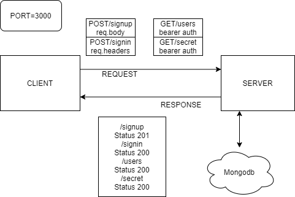

# LAB 07

## Project: Bearer Auth

### Author

+ Stacy Burris

### Links and Resources

+ [GitHub Pull request](https://github.com/stacyburris/bearer-auth/pull/2)
+ [GitHub Repo](https://github.com/stacyburris/bearer-auth)
+ [ci/cd](https://github.com/stacyburris/bearer-auth/actions)
+ [Heroku](https://stacyburris-bearer-auth.herokuapp.com/)

### Setup

`.env` requirements

+ PORT=3000
+ MONGODB_URI=mongodb://localhost:27017/bearer

### How to initialize/run application

+ npm start or nodemon

### Endpoint

In Terminal

Postman:
```
http POST :3000/signup
    Authorization: No Auth Body: { "username":______, "password":_____" }
http POST :3000/signin
    Authorization: No Auth Body: { "username":______, "password":_____" }
http GET :3000/users
    Authorization: Bearer Token: <enter token in>
http GET :3000/secret
    Authorization: Bearer Token: <enter token in>
```
### Test

+ Tests run through jest in the terminal

    + npm test

### UML



### Collaborators

+ Simon, Nathan, Ricardo, Mariko and Kristian